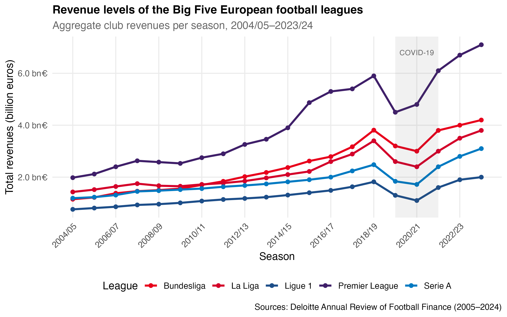
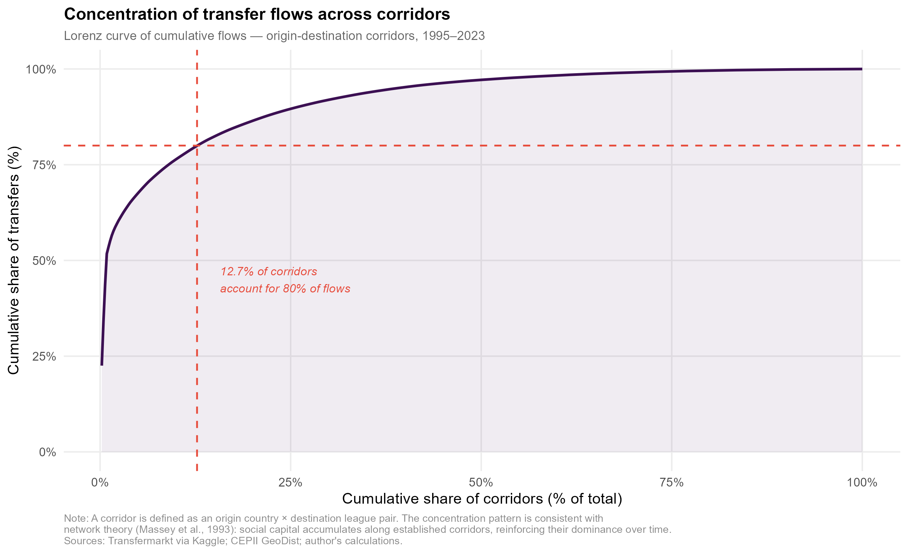

# Determinants of International Football Talent Migration to the European "Big Five"

Master's thesis in International and Environmental Economics, Université Paris 1 Panthéon-Sorbonne (2025–2026). A two-step bilateral gravity analysis of player transfers from emerging economies to England, Spain, Germany, Italy and France over 1995–2023.

## Overview

Professional football is one of the most globalized high-skill labor markets in the world. Over 1995–2023, close to 80,000 international player transfers were recorded between emerging economies and the European "Big Five" leagues. For many developing countries these flows are a significant form of high-value-added service exports, yet they are almost never captured in official trade statistics and rarely studied with modern trade and migration econometrics. This thesis fills that gap.

The financial dominance of the Big Five is the structural backbone of this market: their revenues have grown steadily for two decades, with the Premier League alone surpassing €8 billion in 2023/24.

<p align="center">
  
</p>

## Research question

Beyond athletic merit, which economic, geographic and cultural factors structure the persistent migration of football talent from emerging nations to the Big Five, and what drives the durability of these bilateral transfer corridors?

## Data

The analysis relies on an original bilateral panel of 11,795 origin–destination–year observations, built as a full Cartesian product of origin countries, the five destination leagues, and years from 1995 to 2023. Country pairs with no transfer are kept as explicit zero flows, which is essential for consistent PPML estimation. As a result, 56.5% of observations are strict zeros. Concentration is extreme: 12.7% of corridors account for 80% of all transfers.

<p align="center">
  
</p>

Sources:

- Player transfers: CIES Football Observatory, Transfermarkt
- Distance, common language, colonial ties: CEPII GeoDist (Mayer and Zignago, 2011)
- Bilateral merchandise exports: CEPII Gravity
- GDP per capita: World Bank, World Development Indicators (lagged one period)

The raw transfer data are not redistributed here. See [data/README.md](data/README.md) for sources and reconstruction steps.

## Method

The high share of zeros calls for a two-step gravity strategy that separates whether a corridor forms from how many players flow once it exists.

- Extensive margin (probability a corridor emerges): Probit, with origin and destination fixed effects.
- Intensive margin (volume once active): Poisson Pseudo-Maximum-Likelihood (PPML), with high-dimensional fixed effects.

The specification is validated with a RESET test, which confirms PPML (p = 0.112) and rejects log-linear OLS (p = 0.000), consistent with Santos Silva and Tenreyro (2006). Robustness includes bilateral pair fixed effects, lagged specifications to address reverse causality, continent-split estimation (Africa, Americas, Europe), and a quadratic GDP term. Everything is estimated in R using the `fixest` package (`feglm` for the Probit, `fepois` for PPML).

## Main results

1. Distance still matters. Estimated elasticities range from -0.24 to -1.02; in the preferred PPML specification a 1% increase in distance reduces transfer volume by about 1.02%.

2. A sign reversal in trade integration is the central finding. Stronger bilateral trade raises the probability that a corridor forms (+0.049, extensive margin) but lowers the volume once it is active (-0.173, intensive margin). The result holds under pair fixed effects and lagged tests, pointing to a long-run substitution between goods trade and talent exports.

3. Historical networks dominate. A common language raises expected player flows by about 98%, and a colonial tie by about 48%. For African origins distance becomes statistically insignificant and colonial ties are the primary driver, while the Americas show a large distance penalty offset by a strong language premium.

4. The brain drain is not permanent. An inverted-U relationship in origin GDP (positive linear, negative quadratic term) shows talent exports rising with early development, then falling once domestic leagues grow rich enough to retain elite players.

The preferred PPML specification reaches a pseudo-R² of 0.829.

## Repository

```
scripts/   R scripts: data preparation, Probit, PPML, robustness, plots
outputs/   figures and result tables
data/      data documentation
docs/      abstract and summary
```

## Authors

Co-authored with Lamine Maspimby and Astou Sy, under the supervision of Alejandro Arciniegas Herrera.

Alton Niavo — [LinkedIn](https://www.linkedin.com/in/alton-niavo) · altonniavo@gmail.com
